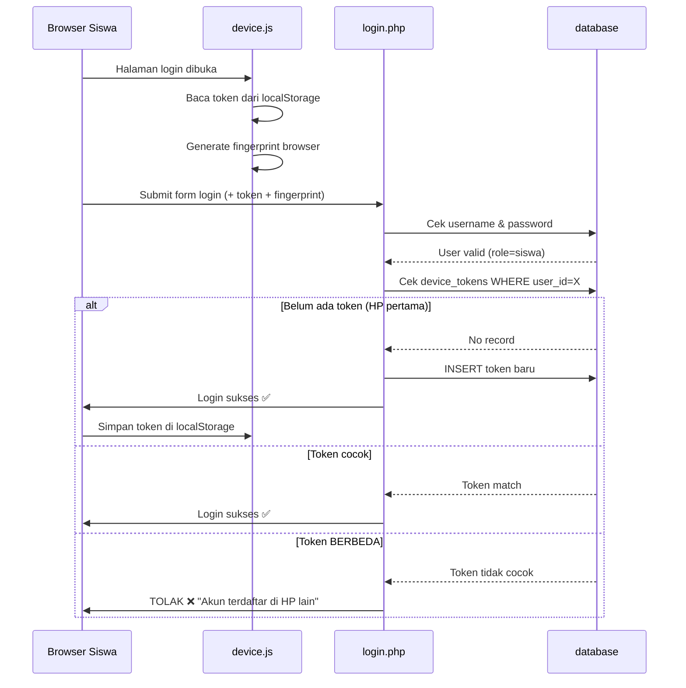

# Revisi SIMAS-GPS: Device Binding & Hosting di Railway

Menambahkan fitur **satu akun siswa = satu perangkat HP** menggunakan sistem Device Token,
serta menyiapkan proyek agar bisa di-push ke GitHub dan di-deploy otomatis ke Railway.

---

## Ringkasan Perubahan

```
Siswa login di HP baru
    → Sistem cek: apakah HP ini sudah terdaftar?
        → Belum terdaftar & akun belum punya device → Registrasi otomatis token HP ini
        → Belum terdaftar & akun SUDAH punya device lain → TOLAK LOGIN
        → HP sudah terdaftar & cocok → IZINKAN LOGIN ✅
        → Akun diblokir admin → TOLAK LOGIN ✗
```

---

## Open Questions

> [!IMPORTANT]
> **Apakah Mode Device Kelas (Shared Tablet) juga kena pembatasan ini?**
> Mode Device Kelas digunakan oleh guru/admin, bukan siswa login sendiri.
> **Rekomendasi saya:** Mode ini TIDAK perlu device binding (karena tablet milik sekolah, bukan siswa).
> Harap konfirmasi apakah setuju.

> [!NOTE]
> **Bagaimana jika siswa pertama kali login?**
> Saat pertama login, belum ada token tersimpan.
> Sistem akan otomatis **mendaftarkan HP tersebut** sebagai perangkat resmi siswa itu.
> Login selanjutnya dari HP lain akan ditolak.

---

## Proposed Changes

### BAGIAN 1: Persiapan GitHub & Railway

---

#### [NEW] `.gitignore`
File untuk mengecualikan file sensitif dari GitHub:
- `config/database.php` (credentials database)
- `uploads/` (foto bukti izin siswa)
- `.env` (environment variables)

#### [NEW] `config/database.php` → Diubah agar baca dari ENV
Untuk Railway, koneksi database tidak boleh hardcode. Akan diubah membaca dari environment variables:
```
DB_HOST, DB_NAME, DB_USER, DB_PASS
```
File `.env.example` akan disediakan sebagai template.

#### [NEW] `.env.example`
Template environment variable yang aman untuk di-push ke GitHub:
```
DB_HOST=localhost
DB_NAME=simas_gps
DB_USER=root
DB_PASS=
APP_ENV=production
BASE_PATH=/
```

#### [NEW] `nixpacks.toml` atau `railway.json`
File konfigurasi Railway agar tahu ini adalah proyek PHP:
- PHP version: 8.0+
- Start command: PHP built-in server atau Apache

#### [NEW] `Procfile`
File untuk menjalankan server PHP di Railway.

---

### BAGIAN 2: Fitur Device Binding (Satu Akun = Satu HP)

---

#### [MODIFY] `database/simas_gps.sql` + Migration SQL baru
Tambah tabel baru `device_tokens`:

```sql
CREATE TABLE `device_tokens` (
  `id`           int(10) UNSIGNED NOT NULL AUTO_INCREMENT,
  `user_id`      int(10) UNSIGNED NOT NULL COMMENT 'FK ke users (role=siswa)',
  `token`        varchar(128) NOT NULL COMMENT 'Token acak yang disimpan di localStorage browser',
  `fingerprint`  varchar(128) DEFAULT NULL COMMENT 'Hash fingerprint browser sebagai lapisan kedua',
  `device_info`  varchar(255) DEFAULT NULL COMMENT 'User-agent HP untuk info saja',
  `registered_at` timestamp NOT NULL DEFAULT current_timestamp(),
  `last_seen_at`  timestamp NOT NULL DEFAULT current_timestamp() ON UPDATE current_timestamp(),
  PRIMARY KEY (`id`),
  UNIQUE KEY `uq_user_id` (`user_id`) COMMENT 'Satu user hanya boleh satu device',
  UNIQUE KEY `uq_token`   (`token`),
  CONSTRAINT `fk_device_user` FOREIGN KEY (`user_id`) REFERENCES `users` (`id`) ON DELETE CASCADE
) ENGINE=InnoDB DEFAULT CHARSET=utf8mb4;
```

#### [NEW] `api/device_check.php`
Endpoint AJAX yang dipanggil oleh JavaScript di halaman login untuk:
1. Mengirim token dari `localStorage` + fingerprint browser ke server
2. Server memverifikasi apakah token cocok dengan akun yang akan login
3. Mengembalikan response: `allowed` / `blocked` / `first_time`

#### [NEW] `assets/js/device.js`
JavaScript yang berjalan di halaman login untuk:
1. **Generate fingerprint** dari karakteristik browser (user-agent, screen resolution, timezone, language, canvas hash)
2. **Baca/Tulis token** dari `localStorage`
3. **Kirim ke server** via AJAX sebelum form login disubmit
4. **Tampilkan pesan error** jika perangkat tidak diizinkan

#### [MODIFY] `login.php`
Tambah logika verifikasi device di proses POST login normal (khusus role `siswa`):

**Alur baru login siswa:**
```
Username + Password benar?
  ↓ Ya
Ambil token dari POST (dikirim JS)
  ↓
Cek tabel device_tokens:
  ├─ Belum ada record → Daftar token baru → LOGIN SUKSES (HP pertama)
  ├─ Token cocok      → Update last_seen → LOGIN SUKSES ✅
  └─ Token BEDA       → TOLAK → Tampilkan pesan "Akun ini terdaftar di HP lain. Hubungi admin."
```

> [!NOTE]
> Admin dan Guru **tidak terkena** pembatasan device binding ini.
> Hanya role `siswa` yang dibatasi.

#### [MODIFY] `includes/auth.php`
Tambah fungsi helper:
- `get_device_token_from_request()` — Ambil token dari POST
- `verify_device_token(int $user_id, string $token, string $fingerprint): string` — return `'ok'|'new'|'blocked'`
- `register_device_token(int $user_id, string $token, string $fingerprint, string $device_info): void`

#### [MODIFY] `admin/kelola_siswa.php`
Tambah tombol **"Reset Device"** pada tabel daftar siswa, sehingga admin bisa mereset perangkat siswa yang ganti HP:
- Tombol reset menghapus record dari tabel `device_tokens` untuk siswa tersebut
- Setelah reset, siswa bisa login dari HP baru dan HP baru tersebut akan terdaftar otomatis

---

### BAGIAN 3: Update Dokumentasi

#### [MODIFY] `PANDUAN-PENGGUNAAN.md`
Tambah seksi baru:
- Penjelasan fitur Device Binding untuk siswa
- Panduan Admin cara reset device siswa yang ganti HP
- Panduan setup environment variable untuk Railway

#### [NEW] `README.md`
File README untuk GitHub yang berisi:
- Deskripsi proyek
- Cara setup lokal (XAMPP)
- Cara deploy ke Railway
- Cara setup environment variables

---

## Alur Lengkap Device Binding



---

## Verification Plan

### Automated Tests
- Tidak ada automated test, verifikasi dilakukan manual.

### Manual Verification

1. **Test Login Normal** — Login sebagai siswa dari HP pertama → harus sukses & token tersimpan di localStorage
2. **Test Blokir HP Lain** — Login akun yang sama dari browser/HP berbeda → harus ditolak dengan pesan error
3. **Test Reset Device Admin** — Admin klik Reset Device → siswa login dari HP baru → harus sukses
4. **Test Admin/Guru** — Pastikan admin dan guru bisa login dari HP manapun tanpa hambatan
5. **Test Deploy Railway** — Push ke GitHub → Railway otomatis build & deploy → akses via URL Railway

---

## Estimasi File yang Diubah

| File | Status | Keterangan |
|---|---|---|
| `database/simas_gps.sql` | MODIFY | Tambah tabel `device_tokens` |
| `database/migration_device_token.sql` | NEW | File migrasi terpisah |
| `config/database.php` | MODIFY | Baca dari ENV variable |
| `includes/auth.php` | MODIFY | Tambah fungsi device token |
| `login.php` | MODIFY | Tambah verifikasi device |
| `admin/kelola_siswa.php` | MODIFY | Tambah tombol Reset Device |
| `assets/js/device.js` | NEW | Logic fingerprint & token |
| `api/device_check.php` | NEW | Endpoint AJAX verifikasi |
| `.gitignore` | NEW | Exclude file sensitif |
| `.env.example` | NEW | Template ENV variable |
| `nixpacks.toml` | NEW | Konfigurasi Railway |
| `Procfile` | NEW | Start command Railway |
| `README.md` | NEW | Dokumentasi GitHub |
| `PANDUAN-PENGGUNAAN.md` | MODIFY | Update panduan |
